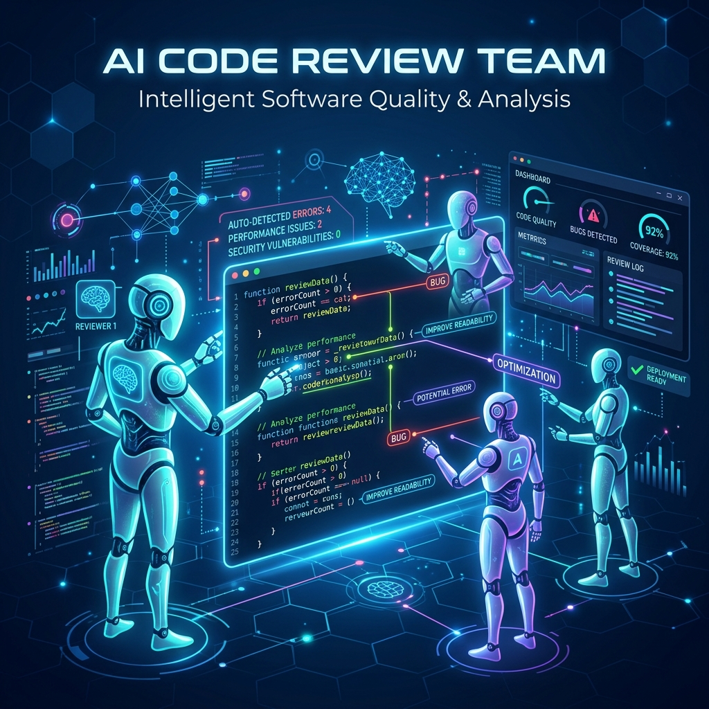

# AI Code Review Team 🚀
### Multi-Agent Software Engineering Assistant



A multi-agent code analysis assistant that reviews source code and automatically generates consolidated professional review reports. Built with a coordinated multi-agent architecture and powered by **Google Gemini 2.5 Flash**, it automates the detection of software bugs, security vulnerabilities, performance bottlenecks, and documentation gaps.

---

## 🌟 Features

- **Multi-Agent Coordination**: A sequential execution pipeline coordinates four highly specialized agents:
  - 🐛 **Bug Detection Agent**: Scans code for logical errors, syntax mishaps, and type mismatches.
  - 🔒 **Security Analysis Agent**: Inspects code for potential vulnerabilities (e.g., injection, weak secrets, improper access).
  - ⚡ **Performance Agent**: Pinpoints bottlenecks (e.g., redundant loops, high-overhead calls) and suggests optimal alternatives.
  - 📝 **Documentation Agent**: Generates a summary of the code and suggests inline documentation or structural updates.
- **Unified Markdown Reports**: Aggregates individual agent outputs into a cleanly structured, download-ready Markdown review report.
- **Smart Caching Layer**: Avoids redundant API calls and saves API quota by hashing files to serve cached results for identical reviews.
- **Double Interface Support**:
  - **Web Dashboard**: An interactive Streamlit interface for writing/pasting code and reading reports side-by-side.
  - **CLI Skill**: A terminal utility allowing developers to easily pipe file reviews into command-line workflows or scripts.

---

## 🎓 Demonstrated Course Concepts

This project directly demonstrates **four** core concepts from the **Kaggle AI Agents: Intensive Vibe Coding** course:

1. **Multi-Agent Systems (ADK Pattern)**
   - Implements a decentralized worker-coordinator architecture where each agent (`bug_agent`, `security_agent`, etc.) operates as a self-contained module exposing a standardized `analyze(input_json_str)` contract.
   - The coordinator manages state, sequences execution, and aggregates separate JSON outputs into a final consolidated Markdown report.

2. **Security & Safe Integration**
   - Incorporates a dedicated **Security Agent** trained to detect critical vulnerabilities.
   - Avoids API key leaks by implementing safe environment management (`.env` file parsing via `python-dotenv`) and explicit git-ignoring of credentials and runtime outputs.
   - Enforces structured JSON output schema validation across all agent boundaries.

3. **Agent Skills (CLI Utility)**
   - Exposes the entire multi-agent code analysis engine as a terminal command-line tool via [cli.py](cli.py).
   - Allows agents or developer workflows to run headless reviews, parse extensions automatically, and dump generated markdown file paths directly into the terminal stream.

4. **Deployability**
   - The project uses a decoupled frontend (`app.py` built with Streamlit) and backend engine (`pipeline.py`).
   - Easily deployable to Streamlit Community Cloud, Hugging Face Spaces, or dockerized and run on Google Cloud Run.

---

## 🛠️ Setup & Installation

### 1. Prerequisites
- Python 3.11+
- A Google Gemini API Key (obtained from [Google AI Studio](https://aistudio.google.com/))

### 2. Clone the Repository
```bash
git clone <your-repo-url>
cd ai_code_review
```

### 3. Create a Virtual Environment & Install Dependencies
```bash
# Create environment
python -m venv venv

# Activate environment (Mac/Linux)
source venv/bin/activate

# Install dependencies
pip install -r requirements.txt
```

### 4. Configure Environment Variables
Create a file named `.env` in the root of the project:
```env
GEMINI_API_KEY=your_actual_gemini_api_key_here
```

---

## 🚀 Running the Application

### Option A: Interactive Web UI (Streamlit)
To launch the rich visual dashboard:
```bash
streamlit run app.py
```
This opens a local browser window (usually at `http://localhost:8501`) where you can paste code, select the programming language, run the review, and download generated reports.

### Option B: Terminal CLI Skill
To review a file directly from your terminal:
```bash
python cli.py path/to/your/code_file.py
```
**Options**:
- Specify language manually: `python cli.py path/to/file.js -l JavaScript`
- Defaults to auto-detecting language based on the file extension (`.py`, `.js`, `.cpp`, `.java`, etc.).

---

## 📁 Repository Structure
```
ai_code_review/
├── assets/                  # Images and visual components
│   └── cover_image.png      # Project cover banner
├── cache/                   # Local review caches (git-ignored)
├── reports/                 # Generated Markdown code reviews (git-ignored)
├── tools/                   # Agent modules and utilities
│   ├── bug_agent.py         # Bug analysis agent logic
│   ├── cache_utils.py       # Hashing and caching utils
│   ├── documentation_agent.py# Docstring and best practices agent
│   ├── gemini_utils.py      # Gemini SDK integration and retries
│   ├── performance_agent.py # Optimization analysis agent
│   ├── report_generator.py  # Consolidated Markdown report writer
│   └── security_agent.py    # Security analysis agent logic
├── .gitignore               # Ignored files (secrets, builds, caches)
├── README.md                # Project documentation
├── requirements.txt         # Project dependencies
├── pipeline.py              # Multi-agent orchestrator script
├── cli.py                   # Command-line utility script
└── app.py                   # Streamlit web dashboard
```
